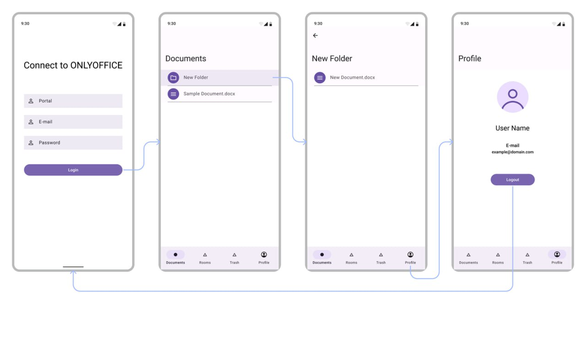

# OnlyOffice-Test

#
На основе публичного API доступного по адресу api.onlyoffice.com реализовать прототип приложение для платформы Android. Тестовый портал можно создать на сайте onlyoffice.com.

# Экран подключения к порталу

Необходимо ввести адрес портала, логин и пароль пользователя и авторизоваться на целевом портале используя метод https://api.onlyoffice.com/docspace/api-backend/usage-api/authentication/authenticate-a-user

Отобразить процесс выполнения запроса. Отобразить ошибки при неудачной авторизации. Валидация формы ввода данных.

# Учетные данные для подключения:
Portal: https://testdocspaceportal.onlyoffice.com/

Email: 1one.test901@gmail.com

Password: Testpass123

# Экран списка файлов
При удачной авторизации отобразить экран со списком содержимого категории "Documents". 
Должна быть реализована навигация по вложенным папкам.

# Экран профиля
Вывести информация о пользователе: аватар, имя пользователя, email.

Переключение между категориями "Documents", "Rooms", "Trash" с выводом содержимого.

Функция выхода, которая возвращает пользователя на экран логина.

# Требования

·  Смена ориентации (поворот экрана) должен обрабатываться с сохранением состояния Activity и фрагментов. 

·  Реализация задания на Kotlin'e

·  Использованием паттернов MVP или MVVM

·  Использование готовых библиотек, например retrofit, gson, glide...
